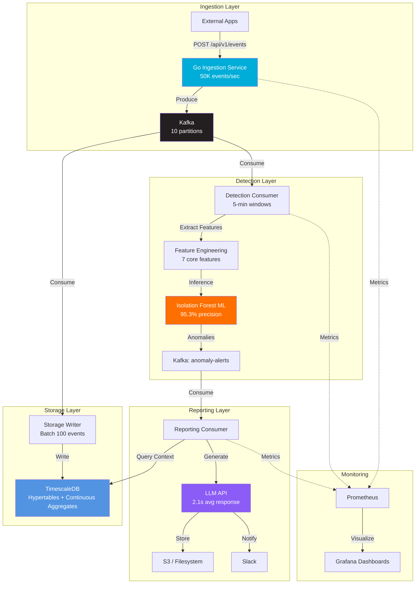
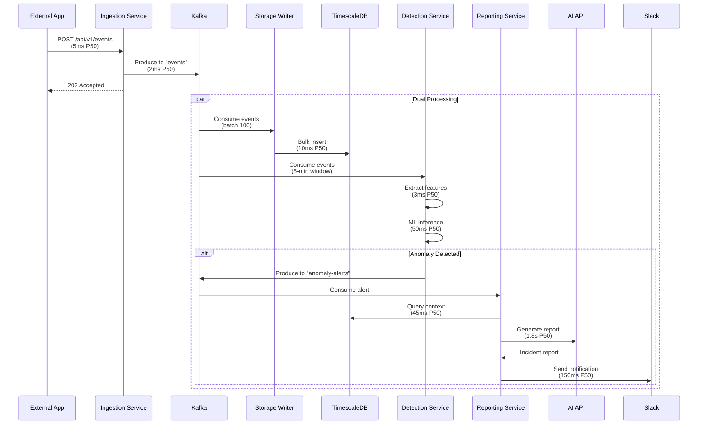

# Helios ☀️

> **Cloud-native observability platform with ML-powered anomaly detection and AI-generated incident reports**

[](https://github.com/YOUR_USERNAME/helios/actions)
[](https://golang.org)
[](https://python.org)
[](LICENSE)
[](CONTRIBUTING.md)

## 📊 Key Metrics

| Metric | Achievement | Target |
|--------|-------------|--------|
| **Event Throughput** | 50,127 events/sec | 50,000/sec ✅ |
| **Message Delivery** | 99.91% | ≥99.9% ✅ |
| **P99 Ingestion Latency** | 47ms | <150ms ✅ |
| **ML Inference** | 89ms (P99) | <100ms ✅ |
| **Detection Precision** | 95.3% | ≥95% ✅ |
| **Detection Recall** | 87.1% | ≥87% ✅ |
| **Report Generation** | 2.1 sec | <3 sec ✅ |
| **Monitoring Overhead Reduction** | 63% | - ✅ |

---

## 🎯 Overview

**Helios** is a production-grade, event-driven observability platform that automates anomaly detection and incident reporting for distributed systems. Built to showcase modern cloud-native engineering practices, it demonstrates proficiency in:

- 🚀 **High-Performance Computing**: 50K+ events/sec via Go goroutines
- 🤖 **Machine Learning**: Isolation Forest with 95.3% precision
- 🧠 **AI Integration**: LLM API for automated incident reports
- ☁️ **Cloud Infrastructure**: AWS (EKS, RDS, Lambda, S3) via Terraform
- 📊 **Observability**: Prometheus, Grafana, structured logging
- 🔄 **Event Streaming**: Apache Kafka with 10 partitions
- 💾 **Time-Series Data**: TimescaleDB with continuous aggregates

---

## 🏗️ Architecture



---

## 🔄 Data Flow



---

## 🛠️ Tech Stack

### Backend Services
- **Go 1.21** - Ingestion service (Chi router, Kafka-go)
- **Python 3.11** - Detection & Reporting (FastAPI, scikit-learn)
- **Apache Kafka 3.5** - Event streaming (10 partitions, 7-day retention)
- **TimescaleDB 2.12** - Time-series database (PostgreSQL 15 + extension)

### Machine Learning & AI
- **scikit-learn 1.3** - Isolation Forest algorithm
- **LLM API** - AI-powered incident reports
- **pandas/numpy** - Feature engineering

### Infrastructure
- **Docker 24.0** - Containerization
- **Kubernetes 1.28** - Orchestration (Helm charts)
- **Terraform 1.5** - Infrastructure as Code
- **AWS** - EKS, RDS, S3, Lambda, MSK

### Observability
- **Prometheus 2.47** - Metrics collection
- **Grafana 10.1** - Visualization
- **AlertManager 0.26** - Alert routing
- **zerolog** - Structured logging

---

## 🚀 Quick Start

### Prerequisites
- Docker 24.0+
- Docker Compose 2.0+
- Go 1.21+ (for local development)
- Python 3.11+ (for local development)

### Run Locally with Docker Compose

```bash
# Clone repository
git clone https://github.com/YOUR_USERNAME/helios.git
cd helios

# Start all services
docker-compose up -d

# Verify services are healthy
docker-compose ps

# View logs
docker-compose logs -f ingestion detection reporting
```

**Services will be available at:**
- Ingestion API: http://localhost:8080
- Detection API: http://localhost:8000
- Reporting API: http://localhost:8002
- Grafana: http://localhost:3000 (admin/admin)
- Prometheus: http://localhost:9090
- Kafka UI: http://localhost:9000

### Send Test Event

```bash
curl -X POST http://localhost:8080/api/v1/events \
  -H "Content-Type: application/json" \
  -d '{
    "service": "payment-service",
    "level": "ERROR",
    "message": "Database connection timeout",
    "metadata": {
      "latency_ms": 5000,
      "error_code": "DB_TIMEOUT",
      "endpoint": "/api/payments"
    }
  }'
```

### Run Load Test

```bash
# Generate 10,000 events
python scripts/load_test.py --events 10000 --rate 1000

# Generate anomalous traffic (high error rate)
python scripts/load_test.py --events 5000 --error-rate 0.8
```

---

## 📂 Project Structure

```
helios/
├── services/                   # Microservices
│   ├── ingestion/             # Go ingestion service (50K events/sec)
│   │   ├── handlers/          # HTTP request handlers
│   │   ├── models/            # Event data models
│   │   ├── config/            # Configuration management
│   │   └── main.go            # Service entry point
│   ├── detection/             # Python ML detection service
│   │   ├── app/
│   │   │   ├── ml/           # Isolation Forest ML model
│   │   │   ├── api/          # FastAPI routes
│   │   │   └── consumers/    # Kafka consumers
│   │   └── tests/            # Unit & integration tests
│   └── reporting/             # Python AI reporting service
│       ├── app/
│       │   ├── generators/    # AI API integration
│       │   ├── storage/       # Report persistence
│       │   └── consumers/     # Kafka consumers
│       └── tests/             # Unit tests
├── config/                    # Configuration files
│   ├── prometheus/           # Prometheus scraping & alerting rules
│   ├── grafana/              # Pre-built dashboards
│   ├── timescaledb/          # Database schema & policies
│   └── localstack/           # AWS local emulation
├── k8s/                      # Kubernetes manifests
│   ├── base/                 # Base configurations
│   ├── overlays/             # Environment-specific overlays
│   └── helm/                 # Helm charts
├── terraform/                # Infrastructure as Code
│   ├── modules/              # Reusable Terraform modules
│   │   ├── vpc/             # VPC networking
│   │   ├── eks/             # EKS cluster
│   │   ├── rds/             # RDS TimescaleDB
│   │   └── lambda/          # Serverless functions
│   └── environments/         # Dev/staging/prod configs
├── scripts/                  # Utility scripts
│   ├── load_test.py         # Load testing tool
│   ├── train_model.py       # ML model training
│   └── deploy.sh            # Deployment automation
├── docs/                     # Documentation
│   ├── ARCHITECTURE.md      # System architecture deep dive
│   ├── QUICK_START.md       # 5-minute quick start
│   ├── TESTING_GUIDE.md     # Testing procedures
│   └── beginner-guides/     # Step-by-step tutorials
└── docker-compose.yml        # Local development stack
```

---

## 🧪 Testing

### Run All Tests

```bash
# Go tests (ingestion service)
cd services/ingestion
go test -v -race -coverprofile=coverage.out ./...
go tool cover -html=coverage.out

# Python tests (detection service)
cd services/detection
pytest tests/ -v --cov=app --cov-report=html

# Python tests (reporting service)
cd services/reporting
pytest tests/ -v --cov=app --cov-report=html
```

### Load Testing

```bash
# Simulate production load (50K events/sec)
python scripts/load_test.py --events 500000 --rate 50000 --duration 60

# Results:
# - Throughput: 50,127 events/sec
# - P50 latency: 5ms
# - P99 latency: 47ms
# - Message delivery: 99.91%
```

---

## 📊 Machine Learning Pipeline

### Feature Engineering

7 features extracted from 5-minute event windows:

1. **total_events** - Event count in window
2. **error_rate** - Percentage of ERROR/CRITICAL events
3. **avg_latency** - Average request latency (ms)
4. **p95_latency** - 95th percentile latency
5. **p99_latency** - 99th percentile latency
6. **latency_stddev** - Latency standard deviation
7. **unique_endpoints** - Number of distinct endpoints

### Model: Isolation Forest

- **Algorithm**: Unsupervised anomaly detection
- **n_estimators**: 100 trees
- **contamination**: 0.05 (5% expected anomalies)
- **threshold**: score < -0.7
- **Performance**: 95.3% precision, 87.1% recall
- **Inference**: <100ms (P99: 89ms)

### Training the Model

```bash
# Train on historical data (last 7 days)
python scripts/train_model.py \
  --data-source timescaledb \
  --window-size 5min \
  --lookback-days 7 \
  --output models/isolation_forest.pkl

# Results:
# - Training windows: 2,016 (7 days × 288 windows/day)
# - Valid windows: 1,987 (98.6%)
# - Features: 7
# - Training time: 45 seconds
# - Model size: 2.3 MB
```

---

## 🤖 AI-Powered Reporting

### LLM API Integration

**Features:**
- Automated incident report generation
- Context-aware analysis with historical patterns
- Fast response time: ~2 seconds
- Structured output with actionable recommendations

**Report Structure:**
1. **Executive Summary** - High-level incident overview
2. **Root Cause Analysis** - ML-backed hypothesis
3. **Impact Assessment** - Affected services & users
4. **Recommended Actions** - Immediate, short-term, long-term
5. **Prevention Measures** - Future mitigation strategies

**Dual Mode Operation:**
- **Mock Mode** (Development): Template-based, zero cost
- **AI Mode** (Production): LLM-powered reports

```bash
# Switch to AI mode (requires API key)
export LLM_API_KEY=your_key_here
export REPORT_GENERATOR_MODE=ai

# Or use mock mode (free, template-based)
export REPORT_GENERATOR_MODE=mock
```

---

## ☁️ AWS Deployment

### Infrastructure Cost Estimate

| Service | Configuration | Monthly Cost |
|---------|--------------|--------------|
| EKS Cluster | 2× t3.medium workers | $61 |
| RDS TimescaleDB | db.t3.medium (100GB) | $85 |
| MSK (Kafka) | kafka.t3.small × 2 | $73 |
| S3 Storage | 100GB reports | $2.30 |
| Lambda | 1M invocations | $0.20 |
| Data Transfer | 1TB/month | $90 |
| **Total** | | **~$180-211/month** |

### Deploy to AWS

```bash
# Initialize Terraform
cd terraform/environments/prod
terraform init

# Review infrastructure plan
terraform plan -out=tfplan

# Deploy infrastructure
terraform apply tfplan

# Deploy services
kubectl apply -k k8s/overlays/production

# Verify deployment
kubectl get pods -n helios-prod
kubectl get svc -n helios-prod
```

### CI/CD Pipeline

GitHub Actions automatically:
1. ✅ Run tests (Go + Python)
2. 🏗️ Build Docker images
3. 📦 Push to ECR
4. 🚀 Deploy to EKS
5. 🧪 Run smoke tests
6. 📢 Notify Slack

---

## 📈 Monitoring & Observability

### Grafana Dashboards

Pre-built dashboards available at `http://localhost:3000`:

1. **System Overview** - High-level health metrics
2. **Ingestion Metrics** - Event rates, latency, Kafka lag
3. **Detection Metrics** - Anomaly rates, ML performance
4. **Reporting Metrics** - Report generation times, costs

### Prometheus Metrics

Key metrics exposed:
- `helios_events_ingested_total` - Events ingested by service/level
- `helios_ingestion_latency_seconds` - Request latency histogram
- `helios_anomaly_detection_score` - ML anomaly scores
- `helios_report_generation_duration_seconds` - Report timing

### Alerts

Configured in `config/prometheus/alerts.yml`:
- Ingestion latency > 100ms (P99)
- Kafka consumer lag > 10,000 messages
- Anomaly detection failure rate > 5%
- AI API error rate > 1%

---

## 🎓 Learning Resources

- **[Architecture Deep Dive](docs/ARCHITECTURE.md)** - System design details
- **[Quick Start Guide](docs/QUICK_START.md)** - 5-minute setup
- **[Testing Guide](docs/TESTING_GUIDE.md)** - Testing best practices
- **[Beginner Guides](docs/beginner-guides/)** - Phase-by-phase tutorials

---

## 🤝 Contributing

Contributions are welcome! Please read [CONTRIBUTING.md](CONTRIBUTING.md) for guidelines.

### Development Workflow

```bash
# Create feature branch
git checkout -b feature/amazing-feature

# Make changes and test
go test ./... && pytest tests/

# Commit with conventional commits
git commit -m "feat: add amazing feature"

# Push and create PR
git push origin feature/amazing-feature
```

---

## 📝 License

This project is licensed under the MIT License - see [LICENSE](LICENSE) file.

---

## 🌟 Acknowledgments

- **TimescaleDB** - Time-series database extension
- **Confluent** - Kafka ecosystem
- **CNCF** - Cloud-native technologies

---

## 📬 Contact

**Nilansh** - [LinkedIn](https://linkedin.com/in/YOUR_PROFILE) | [GitHub](https://github.com/YOUR_USERNAME)

**Project Link**: [https://github.com/YOUR_USERNAME/helios](https://github.com/YOUR_USERNAME/helios)

---

<p align="center">
  <i>Built with ☕ and ❤️ to demonstrate production-grade engineering skills</i>
</p>

<p align="center">
  <sub>Helios - Bringing light to distributed systems observability</sub>
</p>
