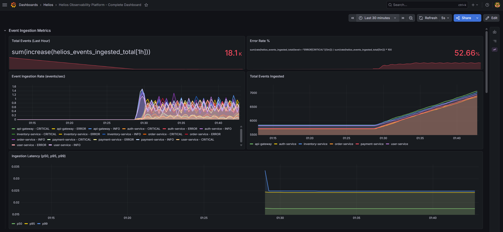
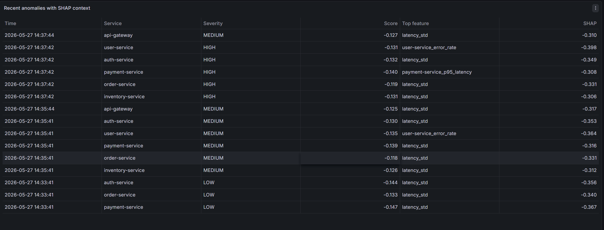
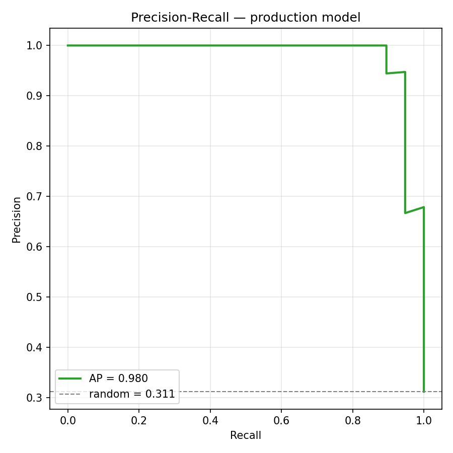
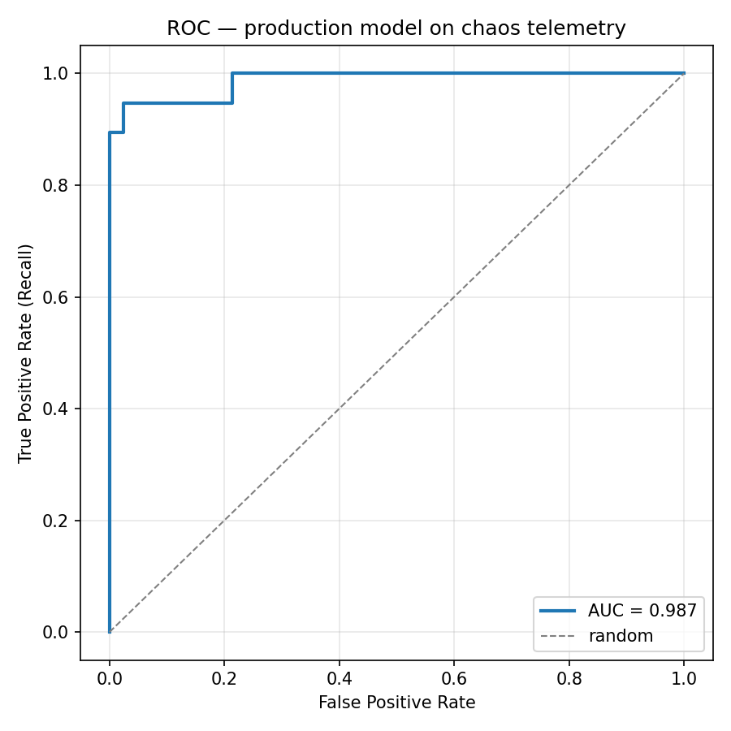
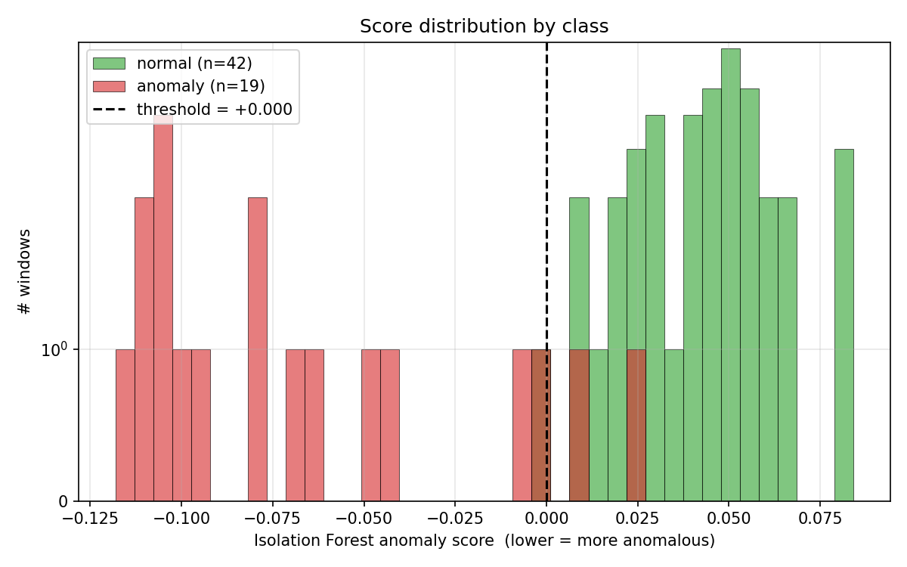
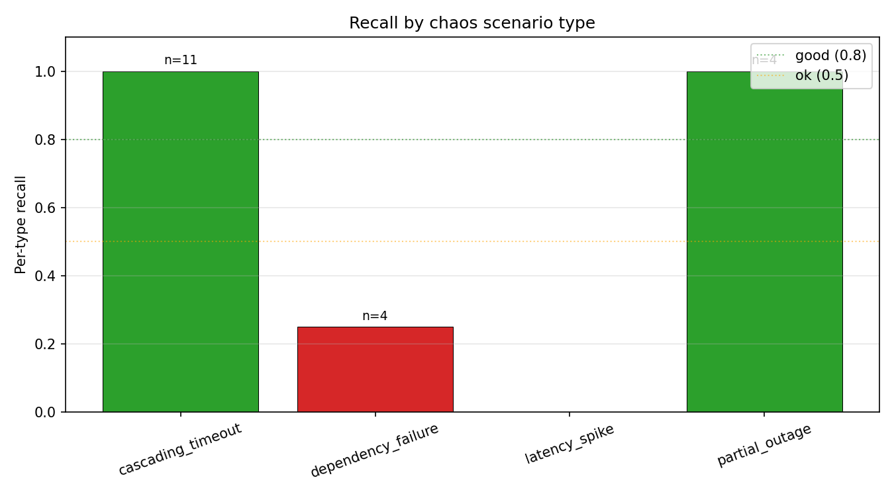
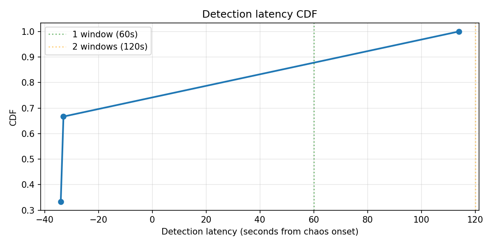

# Helios

Real-time anomaly detection on streaming microservice telemetry, with SHAP-grounded explanations and LLM-generated incident reports.

[](https://golang.org/)
[](https://python.org/)
[](https://kafka.apache.org/)
[](https://docker.com/)
[](LICENSE)

Helios watches the telemetry microservices emit (request latencies, error rates, throughput) and flags windows of traffic that look abnormal. Every alert carries a SHAP attribution showing which features pushed the score, and a language model turns that into a written incident report with a root-cause hypothesis and recommended actions.

The stack is 13 containers wired together with Kafka: a Go ingestion service, a Python stream consumer running an Isolation Forest, TimescaleDB for storage, Prometheus and Grafana for monitoring. The detection model is trained on labeled chaos-injected telemetry that flows through the same live ingestion pipeline used at inference, so training and inference share one feature path.

On a held-out test split (61 windows, 19 anomaly / 42 normal):

- F1 = 0.914, Precision = 1.000, Recall = 0.842
- PR-AUC = 0.980 (random baseline = 0.311), ROC-AUC = 0.987, MCC = 0.887
- Zero false alarms in the clean periods, every chaos scenario flagged within the first overlapping window (P90 detection latency 85s)

Full report: [`models/evaluation/production/REPORT.md`](models/evaluation/production/REPORT.md).
Side-by-side vs a 3-line rule: [`models/evaluation/production/baseline_vs_if.md`](models/evaluation/production/baseline_vs_if.md).

---

## What it looks like

Master dashboard, events streaming through Kafka with ingestion rate and error rate updating live:



Every anomaly carries its SHAP top-3 attribution. The detection consumer writes these into the alert payload, the reporting service surfaces them straight from TimescaleDB. The per-service feature columns (`<service>_error_rate`, `<service>_p95_latency`) show up directly in the top-feature column:



There is also a Helios — Model Health dashboard at `localhost:3100` covering model age, prediction-score distribution over time, anomaly rate, PSI drift, and per-feature live distributions. It's the operator's view rather than the README hero, so it's not pictured here.

---

## Model performance

Same 60-second windows the live detection consumer scores in production, on a held-out test split.

### The curves

Precision–Recall (AP = 0.980, baseline = 0.311 anomaly rate):



ROC (AUC = 0.987):



Score distribution by class. Threshold sits at 0; anomalies cluster below it, normals above. 3.27σ separation:



Recall by chaos scenario type. `cascading_timeout` and `partial_outage` at 100% on the test split. `dependency_failure` recall is lower because most of that scenario falls in validation, only the tail edge ends up in test:



Detection latency. Median is -33s because the overlapping 30s-stride windows catch the chaos in the window straddling its start; P90 is 85s:



### Against a rule-based baseline

On val+test combined (120 windows, 40 anomaly):

|        | Rule  | IF    | Δ      |
|--------|------:|------:|-------:|
| F1     | 0.889 | 0.914 | +0.025 |
| Precision | 1.000 | 1.000 |  0.000 |
| Recall    | 0.800 | 0.842 | +0.042 |
| MCC       | 0.853 | 0.887 | +0.034 |

The rule (`error_rate > 0.05 OR p95_latency > 2 × baseline_p95`) does ~80% of the work in three lines. The IF buys the F1 delta plus things the rule can't give: a continuous score for severity tiers, per-feature SHAP attribution, and tunable operating points along the PR curve. Whether that's worth the complexity is a real question; for this project I think it is, given how much the SHAP attributions matter for the LLM-generated reports.

---

## How it works

```
                  HTTP POST /api/v1/events
                          │
                  ┌───────▼────────┐
                  │  Ingestion     │  Go: validates, normalizes, produces
                  └───────┬────────┘
                          │
                  ┌───────▼────────┐
                  │  Kafka         │  events  ·  anomaly-alerts
                  └──┬──────────┬──┘
            consume  │          │  consume
          ┌──────────▼──┐   ┌───▼─────────────────────┐
          │ Storage     │   │ Detection consumer      │  Python
          │ writer (Go) │   │  · 27-feature pipeline  │
          └──────┬──────┘   │  · Isolation Forest     │
                 │          │  · SHAP TreeExplainer   │
          ┌──────▼──────┐   └───┬─────────────────────┘
          │ TimescaleDB │       │ publish anomaly + SHAP top-3
          │ hypertables │◄──────┤
          └─────────────┘       │
                 ▲          ┌───▼──────────────────────┐
                 │          │ Reporting consumer       │  Python
                 └──────────┤  · Gemini (structured)   │
                  write     │  · IncidentReport schema │
                  report    └──────────────────────────┘

   Prometheus scrapes every service · Grafana · AlertManager
```

1. Ingestion (Go). HTTP server accepts events, validates the schema, partitions by service name, produces to Kafka.
2. Storage writer (Go, same image as ingestion, different binary). Batch-writes to TimescaleDB hypertables.
3. Detection consumer (Python). Keeps a rolling per-service buffer, extracts 27 features per window, scores with the Isolation Forest, computes SHAP top-3 on flagged windows, publishes the alert to Kafka.
4. Reporting consumer (Python). Reads the alert, queries TimescaleDB for context, calls Gemini with `response_schema=IncidentReport`. Pydantic validates the response before storage.
5. Monitoring. Prometheus scrapes everything. Grafana has a master dashboard and a model-health dashboard. AlertManager routes drift / staleness alerts.

### The 27-feature pipeline

`services/detection/app/ml/feature_engineering.py` turns each 60-second window into 27 features.

11 global features describe the system: `event_count`, `error_rate`, `p50/p95/p99_latency_ms`, `latency_std`, `p95_p50_ratio`, `p99_p95_ratio`, `error_count`, `log_event_count`, `log_error_rate`.

16 per-service features (2 metrics × 8 services): `<service>_error_rate` and `<service>_p95_latency` for `api-gateway`, `auth-service`, `user-service`, `payment-service`, `inventory-service`, `notification-service`, `recommendation-engine`, `search-service`.

The per-service columns are what makes a single global model viable. A 20% error spike on a 5%-traffic service shifts the global `error_rate` by about 1 percentage point, which gets lost in normal variance. The same spike shifts that service's own column by 19 points, which the IF and SHAP can both see. One model, one explainer, but with enough feature-space resolution to localize the incident.

The same extraction code runs at training and at inference. If it diverged, the numbers above wouldn't describe the deployed model.

---

## How the model gets trained

1. `scripts/generate_chaos_traffic.py` simulates 8 services with realistic per-service patterns (log-normal latency, daily seasonality, base error rates) and injects 6 scenario types of labeled chaos through the HTTP ingestion API. Writes a timeline JSON describing every scenario. Default run is 90 minutes: 30 minutes of clean baseline at the start, then 60 minutes with chaos scenarios placed throughout.
2. `scripts/train_production.py` reads the events back from TimescaleDB, builds overlapping 60s windows at 30s stride, labels each from the timeline, splits temporally (anomalies cluster in time, so random splits leak), trains `AnomalyDetector` through the production `FeatureExtractor`. Sweeps the threshold on validation to maximize F1, saves the threshold inside the model pickle.
3. `scripts/evaluate_production.py` produces the metric suite above plus the PR/ROC/score-histogram/per-scenario plots. `scripts/evaluate_baseline.py` runs the rule comparison.
4. Deploy: `docker cp` the pkl into the detection containers, restart. The model lives in a named Docker volume, not baked into the image. Details in [`docs/interview-prep/14-deployment.md`](docs/interview-prep/14-deployment.md).

---

## Benchmark validation

The same windowing pipeline is also evaluated on two public labeled anomaly-detection benchmarks, separate from the production-distribution numbers above:

| Dataset | F1 | Precision | Recall | FPR | PR-AUC | ROC-AUC |
|---|---|---|---|---|---|---|
| NAB (Numenta Anomaly Benchmark, Neurocomputing 2017) | 0.326 | 0.338 | 0.314 | 0.063 | 0.276 | 0.635 |
| SMD (Server Machine Dataset, OmniAnomaly KDD 2019) | 0.327 | 0.274 | 0.405 | 0.052 | 0.369 | 0.810 |

Streams (NAB) and machines (SMD) are split 60/20/20 by identity into train / val / test. Threshold picked by F1 sweep on val. PR/ROC curves and the model card are in [`models/evaluation/`](models/evaluation/). Reproduce with `python scripts/evaluate.py --dataset both`.

These numbers are for the pipeline running over heterogeneous benchmark streams, not the production-distribution model. Both are reported because they answer different questions: "does the pipeline architecture work on standard benchmarks" vs "does the deployed model work on its own deployment distribution".

---

## Running it locally

Requires Docker Desktop (Compose v2) and around 8 GB of free memory.

```bash
git clone https://github.com/Nilanshjain/Helios.git helios && cd helios
cp .env.example .env        # optional: add GEMINI_API_KEY for real LLM reports
python scripts/demo.py      # brings the stack up, seeds data, opens Grafana
```

`demo.py` runs `docker compose up --wait`, seeds historical events, starts a background traffic generator, opens the master dashboard at `http://localhost:3100` (admin / admin). A `GEMINI_API_KEY` is only needed for the LLM report step; everything else runs without one.

Other entry points (see the [`Makefile`](Makefile)):

```bash
make train-production    # 90-min chaos run + train + evaluate
make evaluate            # NAB + SMD benchmark eval
make drift               # PSI drift report
python scripts/dry_run.py   # in-process pipeline verification
```

---

## Verifying it works

`scripts/dry_run.py` exercises the production code (feature extraction, the Isolation Forest, SHAP, alert payload serialization, the DB insert shape, report generation, schema round-trip) in a single process, with no infrastructure required. It's the fastest way to confirm a change didn't break the pipeline.

---

## Repository layout

```
services/
  ingestion/        Go: HTTP event ingestion + Kafka producer + storage-writer (one image, two binaries)
  detection/        Python: Isolation Forest, 27-feature pipeline, SHAP, FastAPI + Kafka consumer
  reporting/        Python: LLM incident-report generation (BaseGenerator: Gemini / Claude / Mock)
scripts/
  generate_chaos_traffic.py   labeled chaos telemetry into the live ingestion API
  train_production.py         production trainer
  evaluate_production.py      industry metrics + per-scenario diagnostics
  evaluate_baseline.py        rule-based baseline + side-by-side vs IF
  evaluate.py                 NAB + SMD benchmark evaluation
  drift_check.py              PSI feature-drift report
  dry_run.py                  in-process pipeline verification
  demo.py                     one-command local bring-up
models/
  isolation_forest.pkl        trained model (joblib pickle)
  model_config.json           training metadata
  training_metrics.json       per-split metrics
  evaluation/
    production/               REPORT.md, report.json, baseline_vs_if.md, 5 PNG plots
    model_card.md             benchmark eval model card (NAB + SMD)
config/                       Prometheus, Grafana dashboards, AlertManager
docs/
  interview-prep/             Obsidian vault: ML core, infra, gotchas (local-only, .gitignored)
  sample-reports/             example LLM-generated incident reports
docker-compose.yml            the 13-service stack
```

---

## Technology

Go 1.21, Python 3.11, scikit-learn, SHAP, Apache Kafka, TimescaleDB (PostgreSQL 15), Prometheus, Grafana, Docker Compose, Google Gemini, MLflow.

## Notes and limitations

- The 8 services with per-service feature columns are hardcoded in `feature_engineering.py:KNOWN_SERVICES`. New services in production contribute to global features but not to per-service columns; adding one is a 1-line change plus a retrain.
- A single global model is a deliberate trade. Per-service models would probably improve F1 by 5–10% but multiply the explanation story (which model's SHAP is responsible for a cross-service incident?). The per-service feature columns are how this project gets localization without that fragmentation.
- The chaos generator simulates realistic per-service traffic. It isn't Online Boutique or chaos-mesh. Real-traffic next step (Option B.1 in the planning notes) was scoped and deferred for infra cost.
- The stack is single-instance. Kafka is partitioned and the consumers are group-based, so horizontal scaling is config, not a rewrite. It hasn't been load-tested at scale.

## License

MIT, see [LICENSE](LICENSE).
