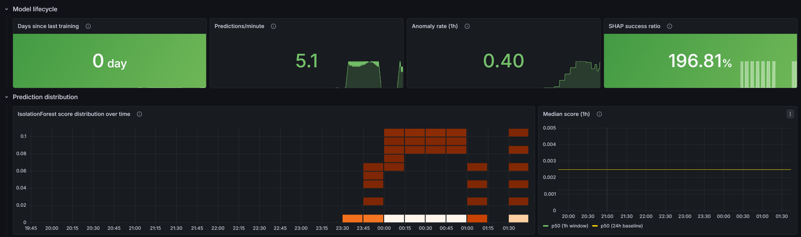
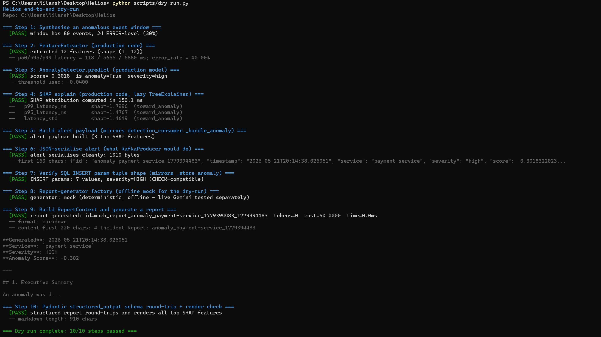

# Helios

**Real-time anomaly detection on streaming service telemetry — with SHAP-grounded explanations and LLM-generated incident reports.**

[](https://golang.org/)
[](https://python.org/)
[](https://kafka.apache.org/)
[](https://docker.com/)
[](LICENSE)

Helios watches the telemetry that microservices emit — request latencies, error
rates, throughput — and flags windows of traffic that look abnormal. Every
anomaly it raises comes with a SHAP attribution showing *which features drove
the score*, and a language model turns that into a written incident report with
a root-cause hypothesis and recommended actions.

It runs as a 13-container, event-driven stack: Go for ingestion, Kafka as the
backbone, an Isolation Forest in a Python stream consumer, TimescaleDB for
storage, and Prometheus + Grafana for monitoring. I built it to be *measured* —
the detection model is evaluated against two public labeled benchmarks, and the
explainability and drift monitoring are wired into the live pipeline rather than
bolted on after the fact.

- **Detection performance:** F1 0.326 on NAB, 0.327 on SMD (held-out splits of
  two public benchmarks) — [methodology below](#model-performance).
- **Project writeup:** [`docs/PROJECT_WRITEUP.md`](docs/PROJECT_WRITEUP.md) — the
  long-form walkthrough of the design decisions.
- **Sample output:** [`docs/sample-reports/`](docs/sample-reports/) — real
  incident reports generated by the system, in Markdown and PDF.
- **MLOps notes:** [`docs/MLOPS.md`](docs/MLOPS.md) — drift methodology, the
  retraining playbook, and the metric reference.

---

## What it looks like

The master dashboard — events streaming through Kafka, ingestion rate and error
rate updating live:


Every anomaly the detector raises carries its **SHAP attribution** — the exact
features that pushed the score, written into the alert by the detection consumer
and surfaced straight from TimescaleDB:


A separate **model-health dashboard** tracks the prediction-score distribution
and prediction rate over time — the basis for spotting drift before it turns
into bad calls:



---

## Model performance

The detection model is an Isolation Forest over a 12-feature representation of
each service's recent traffic. I evaluated it on two public labeled
anomaly-detection benchmarks rather than only on synthetic data:

| Dataset | F1 | Precision | Recall | FPR | PR-AUC | ROC-AUC |
|---|---|---|---|---|---|---|
| **NAB** — Numenta Anomaly Benchmark (Neurocomputing 2017) | 0.326 | 0.338 | 0.314 | 0.063 | 0.276 | 0.635 |
| **SMD** — Server Machine Dataset (OmniAnomaly, KDD 2019) | 0.327 | 0.274 | 0.405 | 0.052 | 0.369 | 0.810 |

Streams (NAB) and machines (SMD) are split 60/20/20 by identity into
train / validation / test, so the test data is never seen during training or
threshold selection. The decision threshold is chosen by sweeping for best F1 on
the validation split. Confusion matrices and PR/ROC curves are in
[`models/evaluation/`](models/evaluation/); the full model card —
intended use, data, limitations — is in
[`models/evaluation/model_card.md`](models/evaluation/model_card.md).

Reproduce it with `python scripts/evaluate.py --dataset both`.

These are honest numbers for unsupervised streaming anomaly detection — a hard
problem where a single global model has to generalize across very different
streams. They are a proxy for production behavior, not a guarantee of it: in
production Helios scores 12-feature windows over real Kafka event streams, where
`error_rate` comes from `ERROR`/`CRITICAL` log ratios rather than the
benchmarks' normalized signals.

---

## How it works

```
                  HTTP POST /api/v1/events
                          │
                  ┌───────▼────────┐
                  │  Ingestion     │  Go — validates, normalizes, produces
                  └───────┬────────┘
                          │
                  ┌───────▼────────┐
                  │  Kafka         │  topic: events  ·  topic: anomaly-alerts
                  └──┬──────────┬──┘
            consume  │          │  consume
          ┌──────────▼──┐   ┌───▼─────────────────────┐
          │ Storage     │   │ Detection consumer       │  Python
          │ writer (Go) │   │  · 12-feature extraction │
          └──────┬──────┘   │  · Isolation Forest      │
                 │          │  · SHAP TreeExplainer    │
          ┌──────▼──────┐   └───┬──────────────────────┘
          │ TimescaleDB │       │ publish anomaly + SHAP
          │ hypertables │◄──────┤
          └─────────────┘       │
                 ▲          ┌───▼──────────────────────┐
                 │          │ Reporting consumer        │  Python
                 └──────────┤  · Gemini (structured)    │
                  write     │  · IncidentReport schema  │
                  report    └───────────────────────────┘

   Prometheus scrapes every service · Grafana dashboards · AlertManager
```

1. **Ingestion (Go).** An HTTP service validates incoming events and produces
   them to the Kafka `events` topic. Per-request latency is exported as a
   Prometheus histogram and plotted p50/p95/p99 on the master dashboard;
   `scripts/load_test.py` drives synthetic load against the endpoint.

2. **Storage (Go).** A separate consumer batch-writes every event into
   TimescaleDB hypertables, time-partitioned for fast range queries.

3. **Detection (Python).** A stream consumer keeps a rolling per-service buffer,
   and roughly once a minute extracts 12 features from each service's window and
   scores it with the Isolation Forest. When a window crosses the threshold, it
   computes a **SHAP TreeExplainer** attribution, writes the anomaly and its top
   features to TimescaleDB, and publishes an alert to `anomaly-alerts`. A
   per-service cooldown deduplicates a sustained incident into one alert.

4. **Reporting (Python).** A consumer on `anomaly-alerts` builds a context
   prompt and calls **Google Gemini** to produce a structured `IncidentReport`
   (a Pydantic schema) — executive summary, SHAP-grounded root cause, tiered
   recommended actions — validated against the schema before it is stored to
   TimescaleDB and rendered to PDF.

5. **Monitoring.** Prometheus scrapes all services; Grafana renders the master
   dashboard and a dedicated model-health dashboard; AlertManager carries the
   drift alerts.

### The 12-feature pipeline

`services/detection/app/ml/feature_engineering.py` turns a window of events into:

`event_count` · `error_rate` · `p50/p95/p99_latency_ms` · `latency_std` ·
`hour_of_day` · `p95_p50_ratio` · `p99_p95_ratio` · `error_count` ·
`log_event_count` · `log_error_rate`

The same extraction code runs in training, evaluation, and production — if it
diverged, the benchmark numbers would not describe the deployed model.

---

## Running it locally

Requires Docker Desktop (Compose v2) and ~8 GB of free memory.

```bash
git clone https://github.com/Nilanshjain/Helios.git helios && cd helios
cp .env.example .env        # optional: add GEMINI_API_KEY for real LLM reports
python scripts/demo.py      # brings the stack up, seeds data, opens Grafana
```

`demo.py` runs `docker compose up --wait`, seeds historical events, starts a
background traffic generator, and opens the master dashboard at
`http://localhost:3100` (admin / admin). A `GEMINI_API_KEY` is only needed for
the LLM report step — every other component runs end-to-end without one.

Other entry points (see the [`Makefile`](Makefile)):

```bash
make evaluate       # re-run the NAB + SMD evaluation
make drift          # compute a PSI drift report
python scripts/dry_run.py   # verify the whole pipeline in-process (below)
```

---

## Verifying it works

`scripts/dry_run.py` exercises the real production code — feature extraction,
the Isolation Forest, SHAP, the alert payload, serialization, the database
insert shape, report generation, schema round-trip — in a single process, with
no infrastructure required:



It is the fastest way to confirm a change didn't break the pipeline, and it
keeps the code paths in the README honest.

---

## Repository layout

```
services/
  ingestion/        Go — HTTP event ingestion, Kafka producer
  storage/          Go — Kafka consumer, batch writes to TimescaleDB
  detection/        Python — Isolation Forest, 12-feature pipeline, SHAP
  reporting/        Python — LLM incident-report generation
scripts/
  evaluate.py       NAB + SMD evaluation harness
  drift_check.py    PSI feature-drift report
  dry_run.py        in-process end-to-end pipeline verification
  train_model.py    model training with an F1 threshold sweep
  demo.py           one-command local bring-up
models/evaluation/  results.json, model_card.md, PR/ROC/confusion plots
config/             Prometheus, Grafana dashboards, AlertManager
docs/               project writeup, MLOps notes, sample reports
docker-compose.yml  the 13-service stack
```

---

## Technology

Go 1.21 · Python 3.11 · scikit-learn · SHAP · Apache Kafka · TimescaleDB
(PostgreSQL 15) · Prometheus · Grafana · Docker Compose · Google Gemini.

## Notes and limitations

- Benchmark performance is a proxy for production: the public datasets are not
  microservice telemetry, and a single global model is deliberately a
  conservative baseline. Per-service models would likely do better — a tradeoff
  discussed in the [writeup](docs/PROJECT_WRITEUP.md).
- The training data for the deployed model is synthetic; the *evaluation* uses
  real labeled data, but closing that gap with production traffic is the
  honest next step.
- The stack is single-instance. Kafka is partitioned and the consumers are
  group-based, so horizontal scaling is a configuration change, not a rewrite —
  but it has not been load-tested at scale.

## License

MIT — see [LICENSE](LICENSE).
